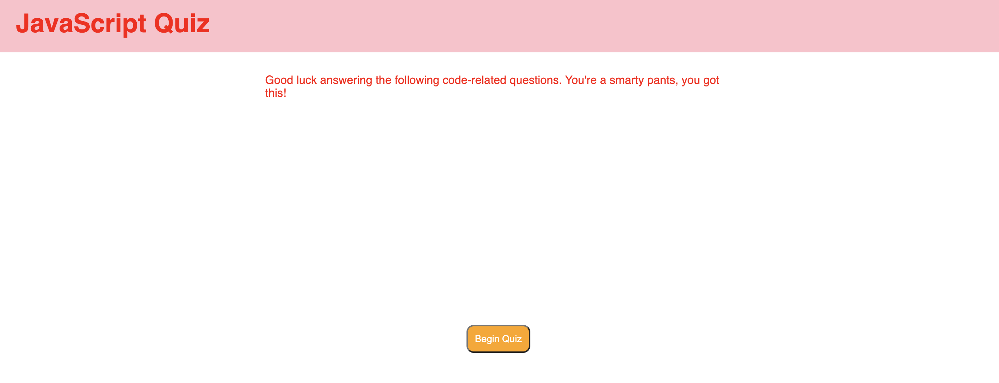
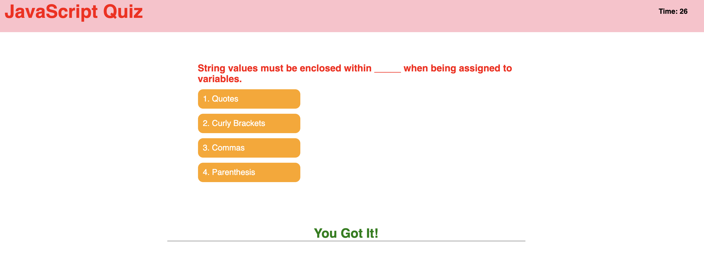
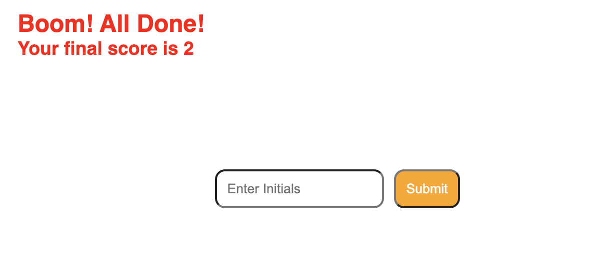

# JavaScript Code Quiz

## Description 

This week I was challenged with creating a quiz with JavaScript, and containing JavaScript questions.

While creating my site, I found challenges around every corner, but found that Google is a great friend, and so is my lovely tutor, Kelly!

Overall this was a difficult project, but one that was fun to show off once finished with. 

## Site Location

[Site Location](https://abbycav7.github.io/js-code-quiz/)

## Site Image

